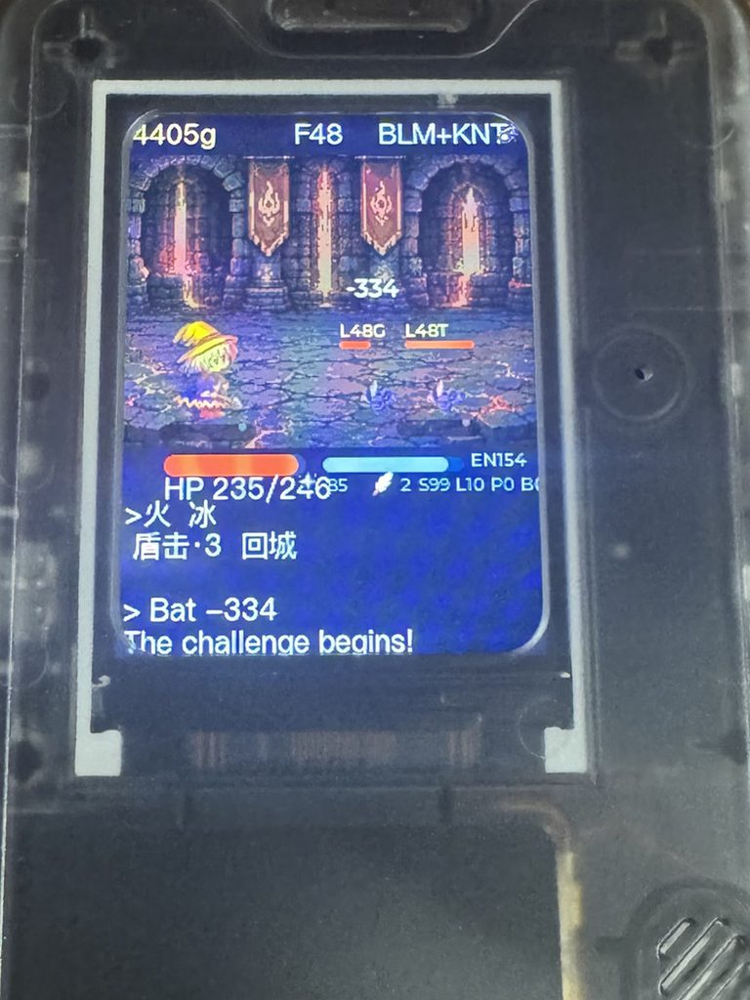
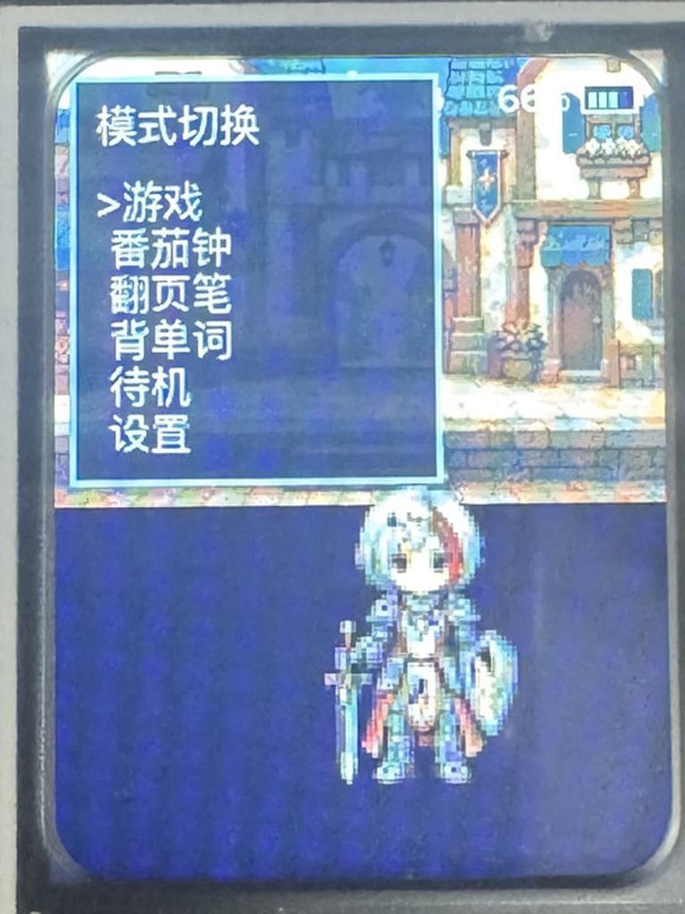
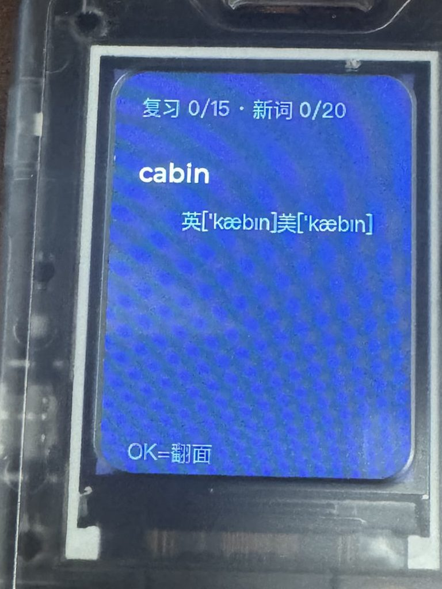
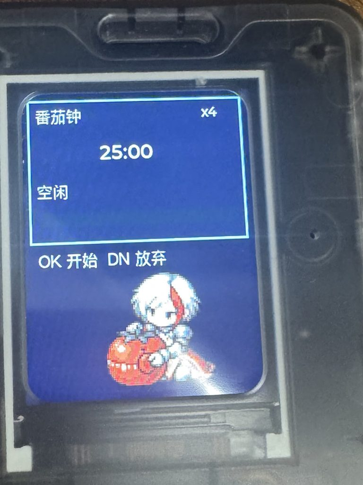
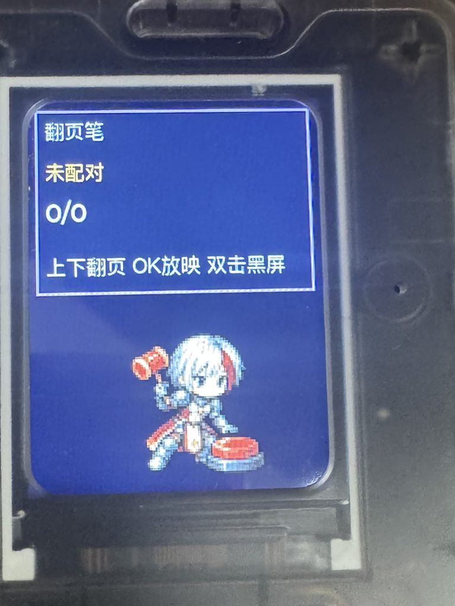

# 四合一：放置 / 背单词 / 番茄钟 / 翻页笔

**4-in-1 Idle, Vocab, Pomodoro & Clicker**

把 AI Passport 变成口袋里的桌宠：自己爬迷宫、背单词、盯番茄钟、当翻页笔。三键，中英双语，不用联网。

Turn AI Passport into a pocket companion: an idle dungeon, vocabulary cards, a pomodoro, and a presenter clicker. Three keys. Chinese and English. Offline.

社区名（审核中）：[DeskPet](https://github.com/fakechris/moyu-badge) · slug `deskpet`

---

## 实机 / On device

<p>





</p>

| | 中文 | English |
|---|---|---|
| 放置 | 宠物自己爬 100 层塔。你亮屏时换职、放技能、选房间、决定回城。 | The pet climbs a 100-floor tower on its own. When you look: job, skill, room card, retreat. |
| 背单词 | 看英文想中文，到期复习优先；可选反向回想 / 三选一。 | English → Chinese, due reviews first; optional reverse recall / 3-choice. |
| 番茄钟 | 专注计时，宠物跟着状态变。 | Focus timer; the pet changes with the session. |
| 翻页笔 | 配对电脑后上下翻页，OK 放映。 | Pair as a clicker: up/down turns slides, OK starts the show. |
| 待机 | 时钟，宠物睡觉。 | Clock face, pet asleep. |

长按 **OK** 打开模式切换，五个模式加设置都在这一层。离开任何模式也是长按 OK，模式之间不互跳。

Hold **OK** for the mode switcher. That is the only way out of a mode; nothing jumps automatically.

---

## 怎么玩放置 / How idle play works

九成时间看着它打。亮屏才做少数重决策：

Most of the time you watch. The few keys that matter:

- 切职业，立刻换打法（骑士墙、黑魔炮、白魔奶、盗贼、暗骑）
- 放技能、房间三选一
- 烟遁保金币回城，或死亡清掉本跑现金
- Swap jobs and the fight changes (knight, black mage, white mage, thief, dark knight)
- Fire a skill or pick a room card
- Smoke out to keep gold, or die and lose this run's cash

培养（职业级、装备、圣所、转生）跨死亡保留。清完 100 层进下一周目，怪变强。

Job levels, gear, sanctuary, and prestige survive death. Floor 100 starts a new cycle; monsters scale up.

---

## 按键 / Keys

| 键 | 短按 | 长按 |
|---|---|---|
| UP / DOWN | 菜单光标；放置里切职 | — |
| OK | 确认 / 翻面 / 放技能 | **全局切模式** |

---

## 安装 / Install

1. 玩法社区审核通过后，可在 [AI Passport 玩法社区](https://ai-passport.folotoy.cn/plays/) 一键安装（当前状态：**pending / 待审核**，还不能公开安装）。
2. 本地已有合并镜像时，用[网页刷机](https://ai-passport.folotoy.cn/tools/web-flasher/) 选择 `FoloToy-AI-Passport-full.bin`，从 `0x0` 写入。

After review, install from the [play community](https://ai-passport.folotoy.cn/plays/) (this listing is **pending**, not public yet). Or flash `FoloToy-AI-Passport-full.bin` from offset `0x0` with the [web flasher](https://ai-passport.folotoy.cn/tools/web-flasher/).

日常自己更新固件：`tools/flash.sh` 只写应用分区。不要 `erase-flash`。开机按住 **UP 5 秒** 仍可进设备自带 Recovery。

Day-to-day updates: `tools/flash.sh` writes the app slot only. Never `erase-flash`. Hold **UP for 5 seconds** at boot to enter the device's permanent Recovery.

---

## 构建 / Build

```bash
source ~/esp/esp-idf-v5.5.3/export.sh
# BSP: ../my-ai-passport/ai-passport/components  （DESKPET_BSP_DIR 可覆盖）
idf.py build
idf.py merge-bin -o build/FoloToy-AI-Passport-full.bin
tools/validate-host.sh
python3 tools/budget.py
```

```text
main/     firmware, sprites, fonts, word list
tools/    flash / host gates / size budget
sim/      desktop simulator (keyboard = three keys)
tests/    host model tests
docs/     design notes + screenshots
```
